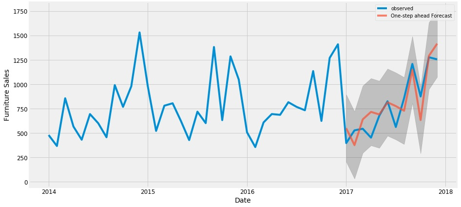
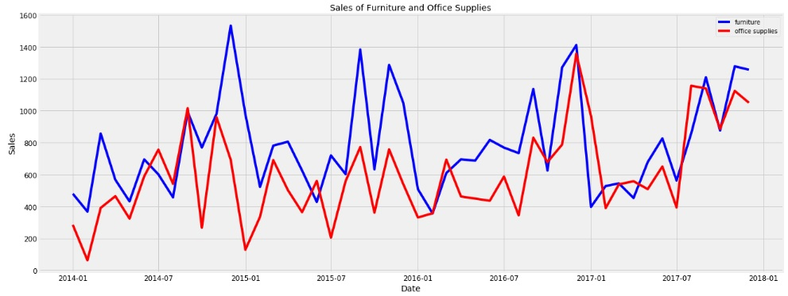

# Time Series Analysis (Artificial Intelligence Project)

* @file     : Time_Series_Analysis.ipynb
* @author   : Sinan KAMILCELEBI
* @version  : V1.0.0
* @date     : 15-May-2019
* @brief    : Time Series Analysis (ARIMA) Example.

## Zaman Serileri Analizi

__Bu uygulamada mobilya satışları için zaman serisi analizi ve tahmini yapılmıştır.__

Kullanılan veri kümesi: https://community.tableau.com/docs/DOC-1236   

Veri kümesi coğrafi yer olarak Kanada konumunu içermekte olup "Superstore" satış verilerinde çeşitli kategorilerde örnekler vardır. Her bir kategoriye ait alt kategoriler de mevcuttur.                                                     

__Mobilya__ kategorisinde bulunan bazı alt kategoriler:    
> Sandalye   
Tablolar   
...  

__Ofis Malzemeleri__ kategorisinde bulunan bazı alt kategoriler:    
> Zarflar  
Kâğıt   
...  

__Teknoloji__ kategorisinde bulunan bazı alt kategoriler:    
> Telefonlar   
Aksesuarlar   
...  

## Tahminleri Doğrulama (TSA Verify Estimates)

## Veri Keşfi-Araması (TSA Data Exploration)

## Referanslar

> https://www.digitalocean.com/community/tutorials/a-guide-to-time-series-forecasting-with-arima-in-python-3
